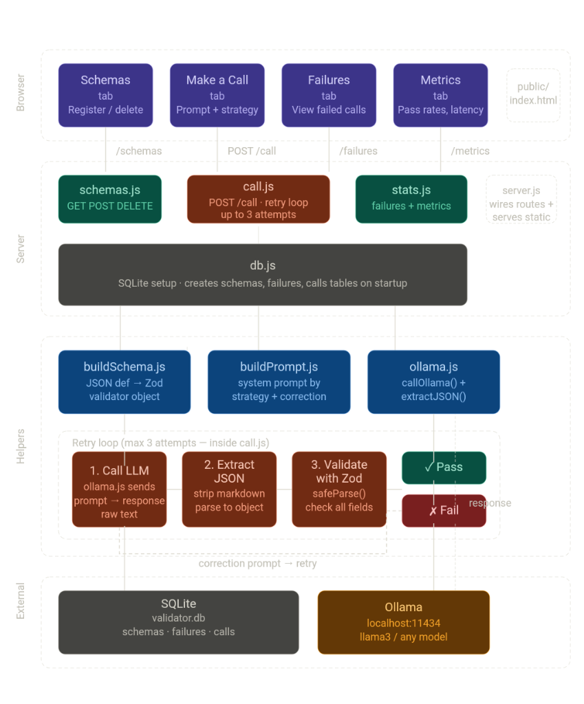
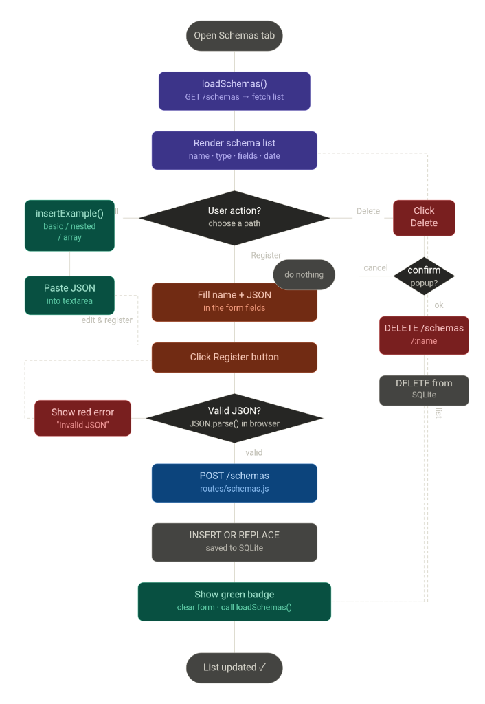

# LLM Output Validator & Schema Enforcer

A middleware layer that guarantees LLM responses match your expected schema — or automatically fixes them until they do.

**Stack: Node.js · Express · Ollama · Zod · SQLite · Vanilla JS**

---

## System Architecture & Flow

### System Architecture


### Schema Flow Diagram


---

## The problem it solves

You ask the model for JSON. It gives you JSON wrapped in a markdown code block, or with an extra explanation paragraph, or with a field name slightly wrong. Your app breaks.

This project is the fix — a validation and auto-correction layer between your LLM call and your application logic.

---

## Features

- Register named schemas using a simple JSON definition format
- Make a validated call — the response is parsed and checked automatically
- If validation fails → sends a correction prompt and retries up to 3 times
- If all 3 fail → logs the failure with full details for debugging
- Two injection strategies: `json_instruction` and `few_shot`
- Metrics dashboard shows pass rates and avg attempts by schema + strategy
- Light and dark mode UI

---

## Project structure

```
llm-validator/
├── server.js                ← starts the Express app
├── db.js                    ← SQLite setup (3 tables)
├── routes/
│   ├── schemas.js           ← GET POST DELETE /schemas
│   ├── call.js              ← POST /call — core retry logic
│   └── stats.js             ← GET /failures  GET /metrics
├── helpers/
│   ├── buildSchema.js       ← JSON definition → Zod validator
│   ├── buildPrompt.js       ← system prompt + correction prompt builder
│   └── ollama.js            ← callOllama() + extractJSON()
├── public/
│   └── index.html           ← full frontend UI (vanilla JS)
├── test-data/
│   ├── schemas.json         ← 12 example schemas
│   ├── prompts.json         ← 30+ test prompts (easy/medium/hard)
│   ├── seed.js              ← auto-registers all schemas
│   └── README.md
├── .gitignore
└── package.json
```

---

## Setup

**1. Install Ollama**

Download from https://ollama.com/download then pull a model:
```bash
ollama pull llama3
```

**2. Install dependencies**
```bash
npm install
```

**3. Start the server**
```bash
node server.js
```

**4. Seed test schemas (optional)**
```bash
node test-data/seed.js
```

**5. Open the UI**

Visit http://localhost:3000

---

## API reference

| Method | Endpoint | Description |
|---|---|---|
| `POST` | `/schemas` | Register a new schema |
| `GET` | `/schemas` | List all schemas |
| `DELETE` | `/schemas/:name` | Delete a schema |
| `POST` | `/call` | Make a validated LLM call |
| `GET` | `/failures` | View all failed calls |
| `GET` | `/metrics` | Pass rates by schema + strategy |

### POST /call — request body

```json
{
  "schema_name": "movie_review",
  "prompt": "Write a review for the movie Interstellar.",
  "model": "llama3",
  "strategy": "json_instruction"
}
```

### POST /call — success response

```json
{
  "success": true,
  "output": {
    "title": "Interstellar",
    "rating": 9,
    "summary": "A visually stunning sci-fi epic about love and time.",
    "recommended": true,
    "tags": ["sci-fi", "space", "drama"]
  },
  "attempt_count": 1,
  "correction_needed": false,
  "total_latency_ms": 3200,
  "total_tokens": 84,
  "attempts": [...]
}
```

### POST /call — failure response

```json
{
  "success": false,
  "error": "All 3 attempts failed validation.",
  "attempts": [
    { "attempt": 1, "raw": "...", "error": "title: expected string" },
    { "attempt": 2, "raw": "...", "error": "rating: expected number" },
    { "attempt": 3, "raw": "...", "error": "tags: expected array" }
  ],
  "total_latency_ms": 9800,
  "total_tokens": 210
}
```

---

## Schema definition format

```json
{
  "type": "object",
  "fields": {
    "title":       { "type": "string", "min": 3 },
    "rating":      { "type": "number", "min": 1, "max": 10 },
    "recommended": { "type": "boolean" },
    "tags":        { "type": "array", "items": { "type": "string" } }
  }
}
```

### Supported types

| Type | Options |
|---|---|
| `string` | `min`, `max`, `enum`, `optional` |
| `number` | `min`, `max`, `optional` |
| `boolean` | `optional` |
| `array` | `items` (any type) |
| `object` | `fields` (nested) |
| `enum` | `values` |

---

## Injection strategies

| Strategy | How it works | Best for |
|---|---|---|
| `json_instruction` | Tells the model "respond only with JSON matching this schema" | Simple flat schemas |
| `few_shot` | Shows the model a filled example of the expected output | Nested objects and arrays |

---

## Correction prompt pattern

When a response fails validation, the next attempt gets:

```
Your previous response failed validation with this error: [error]
The expected schema is: [schema]
Please try again and return ONLY valid JSON. No explanation. No markdown.
```

---

## Hardest schemas to enforce

- **Nested objects** — models sometimes flatten them into a single level
- **Strict number ranges** — e.g. score must be exactly between 100–101
- **Long string minimums** — models truncate when the prompt is unrelated
- **Multiple arrays** — models sometimes return a string instead of an array

When the model fundamentally cannot produce the required output, all 3 attempts fail and the full call is logged to the failures table with every raw LLM response saved for debugging.
